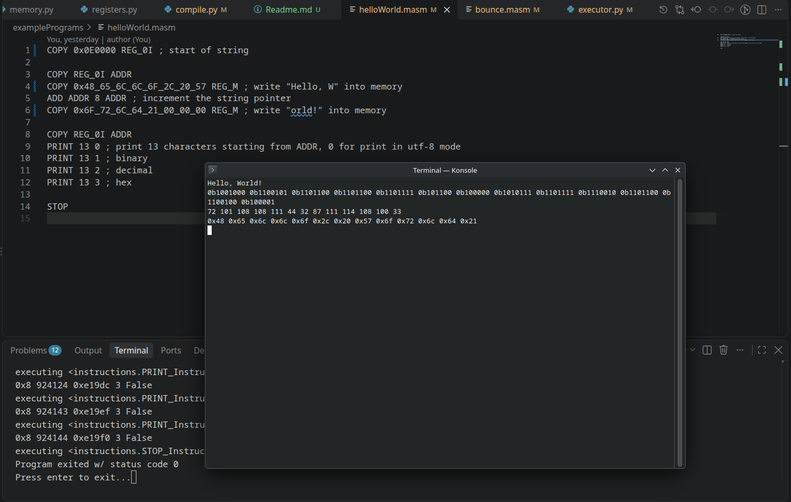

# Mathsembly
An assembly programming language where you have dedicated math instructions



# Installation
1. Create `.venv` via `python -m venv .venv`
2. Activate the venv enviroment via `source .venv/bin/activate`
3. Install dependencies `python -m pip install -r requirements.txt`
4. Compile a program by running `python compile.py`
5. Run your compiled program by running `python executor.py`

# 34 Instructions
- NOP - Does nothing
- STOP - Ends the program
- MOVE - Moves the value from a src register to a destination register while preserving the value's meaning (ie. a 12 from an int register will still be a 12.0 in a float register)
- COPY - Copies the bytes from a src register to a dest register. can break values, ie. a 12 from an int reg becomes 6e-323 in a float register
- CLTB - Copies the least significant byte (rightmost) of the src register into the most significant byte (leftmost) of the destination register
- SHOW - Updates the display
- PRINT - displays the N values in memory, starting at the address held in the ADDR register. the 2nd operand tells us which mode to display in (0 = utf-8, 1=bin, 2=dec, 3=hex)
- NOT - inverts the bytes of the src register and puts it in the dest register
- AND - ANDs the bytes of two src registers and puts it in the dest register
- OR - ORs the bytes of two src registers and puts it in the dest register
- XOR - XORs the bytes of two src registers and puts it in the dest register
- ADD - Adds the values of two src registers and puts it in the dest register
- SUB - Subtracts the values of two src registers and puts it in the dest register
- MULT - Multiplies the values of two src registers and puts it in the dest register
- DIV - Divides the values of two src registers and puts it in the dest register
- MOD - Mods the value of the first src register with the 2nd source registers and puts it in the dest register
- SQRT - Square Roots the value of the src registers and puts it in the dest register
- POW - Puts the value of the first source reg to the power of the value of from the 2nd src register and puts it in the dest register
- LN - Takes the natural log of the value in the src register and puts it in the dest register
- ROUND - Rounds the value in the src register and puts it in the dest register
- FLOOR - Floors the value in the src register and puts it in the dest register
- CEIL - Ceils value in the src register and puts it in the dest register
- SIN - Takes the sine of the value in the src register and puts it in the dest register
- COS - Takes the cosine of the value in the src register and puts it in the dest register
- TAN - Takes the tangent of the value in the src register and puts it in the dest register
- ASIN - Takes the arcsine of the value in the src register and puts it in the dest register
- ACOS - Takes the arccosine of the value in the src register and puts it in the dest register
- ATAN - Takes the arctangent of the value in the src register and puts it in the dest register
- JMZ - Sets the PC to the value of the source register if the zero flag is set
- JMC - Sets the PC to the value of the source register if the carry flag is set
- JMN - Sets the PC to the value of the source register if the negative flag is set
- JMP - Sets the PC to the value of the source register
- PUSH - Increments the stack pointer then pushes the bytes of the source register onto the stack
- POP - Pops the value from the stack into the destination register and then decrements the stack pointer

# 64 General Registers | 8 Bytes
- 32 long long (8 byte integer) registers | REG_0I, REG_1I, ..., REG_31I
- 32 double (8 byte floats point) registers | REG_0F, REG_1F, ..., REG_31F

# Special Registers
- ZERO - 8 Byte all 0s register. Writing will do nothing to it
- PC - 3 Byte program counter register
- SP - 1 Byte stack pointer
- ADDR - 3 Byte address register. Works just like a general register otherwise
- FLAGS - 1 Byte status/flags register. Normal integer register but instructions like `ADD` and `POW` will update it's value
- REG_M - The 8 bytes the ADDR register points. Works just like a general register. Reads and writes interact directly with memory

# Memory Regions
- Everything shares the same memory
- `0x000000` to `0x00000F` | ZERO, PC, SP, ADDR, and FLAGS in that order
- `0x000010` to `0x00010F` | REG_0I to REG_31I
- `0x000110` to `0x00020F` | REG_0F to REG_31F
- `0x000210` to `0x00095F` | 255 long longs (8 Bytes) in the stack
- `0x000960` to `0x00096F` | Video Settings
- `0x000970` to `0x0E196F` | Video Pixel Memory
- `0x0E1970` to `0xFFFFFF` | Program and scratch memory, the first byte of the program is loaded into 0x0E1970 by default

# Video Settings
- It is possible to use the space after the video pixel memory region (inside of the program & scratch memory region) as more video memory if you use more memory than what is given. Be careful to not override your program though!
- Bytes 0 to 15 are mapped from 0x000960 to 0x00096F
- Bytes 0, 1, and 2 are for the video width (10 bits), video height (9 bits), and color bit depth (5 bits)
    - Bits (MSB on the left): WWWWWWWW WWHHHHHH HHHCCCCC
    - W = Video width, the dedicated video memory region has space for a max value of 640 at 24bbp (0x280 or 0b1010000000)
    - H = Video height, the dedicated video memory region has space for a max value of 480 at 24bbp (0x1e0 or 0b111100000)
    - C = Color bit depth, default accepted values are: 1, 8, and 24

Flags Register (76543210)
- Bit 0: Zero flag
- Bit 1: Carry flag (Did overflow/underflow?)
- Bit 2: Negative flag
- Bit 3: 0 - Unused
- Bit 4: 0 - Unused
- Bit 5: 0 - Unused
- Bit 6: 0 - Unused
- Bit 7: 0 - Unused


Writing Code:
- `INSTRUCTION OP1 OP2 ... OPn` This is the format to write instructions, it's instruction name and then all of it's operands
- You can always replace a register with an 8 Byte literal and it will compile (you can write it in decimal, hex, binary, or as a float, just don't exceed the 8byte signed integer limit). Do not replace a destination register with a literal however because it will raise an Exception during runtime
- `;` Used for comments, everything after the first `;` of a line will be ignored
- `#` Used to place all the instructions and code after it into certain regions memory addresses, it must be >= 0x0E1970
    - During compile time `# 0x0E1970` is assumed to be added at the beginning of the program
- `!` Used to define an address (next instruction) to remember. It can be referenced in place of an immediate/register
    - ex.:

            !LOOP
            PRINT 5 0
            ADD ADDR 5 ADDR
            JMP LOOP ; this sets the pc to the address holding the opcode for "PRINT"


# Example programs
You can find some example programs inside of the `./examplePrograms` folder

Here is `helloWorld.masm`:
```
COPY 0x0E0000 REG_0I ; start of string

COPY REG_0I ADDR
COPY 0x48_65_6C_6C_6F_2C_20_57 REG_M ; write "Hello, W" into memory
ADD ADDR 8 ADDR ; increment the string pointer
COPY 0x6F_72_6C_64_21_00_00_00 REG_M ; write "orld!" into memory

COPY REG_0I ADDR
PRINT 13 0 ; print 13 characters starting from ADDR, 0 for print in utf-8 mode
PRINT 13 1 ; binary
PRINT 13 2 ; decimal
PRINT 13 3 ; hex

STOP
```
